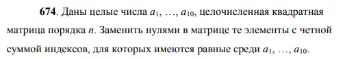
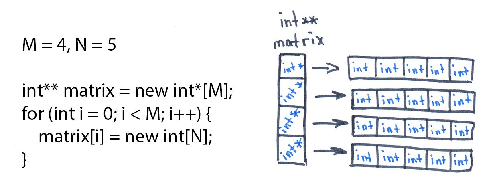

# Задача 674


## Постановка задачи
0. *Для любого кода необходимо осуществлять проверку ввода на корректность, чтобы не положить программу, а также установить локаль для необходимого языка (в нашем случае - русского);*
1. Получить от пользователя 10 чисел (А<sub>1</sub> - А<sub>10</sub>), сохранить их;
2. Получить размер квадратичной матрицы N*N. Выделить под неё память;
3. Заполнить матрицу;
4. Выполнить условие задачи.

## Решение задачи
### Пункт 0: проверка ввода и установка локали
Для установки русской локали используем:
`setlocale(LC_ALL, "Russian")`
Проверку ввода осуществляем с помощью следующих строчек кода:
```cpp
while (!(cin >> <сюда помещаем переменную>)) {
    cout << "Ошибка. Проверьте введённые данные\n";
    cin.clear();
    cin.ignore(numeric_limits<streamsize>::max(), '\n');
}
```

#### Объяснение: 
- `cin >> <переменная>` выдаёт 1 в случае успешного ввода 1 символа, иначе 0. Нам нужно выполнять ввод, пока не будет получено одно число => инвертируем значение через !
- `cin.clear()` очищает ошибки ввода, которые появляются при некорректом вводе.
- `cin.ignore(numeric_limits<streamsize>::max(), '\n')` игнорируем все возможные значения до символа переноса строки (\n). Он также считывается в потоке cin

### Пункт 1: получение чисел A<sub>1</sub> - A<sub>10</sub>
```cpp
int numbers[10];
for (int i = 0; i < 10; i++) {
    cout << "Введите число А" << i+1 << ": ";
    while (!(cin >> numbers[i])) {
        cout << "Ошибка. Проверьте введённые данные\n";
        cin.clear();
        cin.ignore(numeric_limits<streamsize>::max(), '\n');
    }
}
```
 Тут в целом всё понятно. Создаём массив, через цикл for его заполняем. Динамическая память в данном случае не требуется, так как заранее известно, что у нас 10 чисел.

### Пункт 2: Получить размер квадратичной матрицы N*N. Выделить под неё память
```cpp
int size;
cout << "Введите размер для квадратичной матрицы: ";
if (cin >> size && size > 0) {
    int** matrix = new int*[size];
    for (int i = 0; i < size; i++) {
        matrix[i] = new int[size];
    }
```
Тут мы вынуждены использовать динамическую память, так как размер матрицы мы получаем от пользователя. В С++ доступен альтернативный (и, как я считаю, более правильный, так как безопасный) метод для создания динамических матриц — через `std::vector`, но препод сказал использовать new. Окей, бро.
#### Объяснение алгоритма выделения памяти под матрицы
Возьмём для примера матрицу MхN размером 4х5

Для объяснения лучше пойду с конца. Нам нужно хранить int-овые переменные. Связать друг с другом (расположить в памяти ячейки) можно только массив, не матрицу. Чтобы создать массив длинной в N символов, мы должны выделить под него память через `new int[N]`, то есть "выдели память под тип int в кол-ве N штук". Но откуда мы будем знать, где у нас эта область памяти создалась? А вот для этого мы и создаём переменную типа int*, которая является указателем на начало. Как нам получить это начало? А всё просто: умные разработчики языков программирования всё придумали за нас. Функция new возвращает нам адрес в памяти этого начала. Поэтому мы и сохраняем его в тип int*. Если бы была задача создать динамический массив, а не матрицу, мы бы написали следующий код (предположим, что N мы определили где-то до этого): `int* massive = new int[N]`.
Теперь, когда мы научились создавать память под массивы, можно и матрицы пощупать. Мы уже знаем, как создать массив. А что такое матрица? В общем-то, ничто иное, как массив, в каждом элементе которого есть ещё один массив. Чудесно. Значит, нам нужно создать массив (то есть столбец, как на картинке ниже), который будет хранить в себе адрес каждого из массивов. Создаём: `int* matrix = new int*....` ...эм, кажется, что-то не то. Как может указатель указывать на указатель? Вопрос верный. Ответ на него: никак. В данном случае мы должны использовать такой тип данных, как указатель на указатель (int**). В этот раз создаём, но только аккуратно: `int** matrix = new int*[M]`.

Всё верно! А теперь всё в обратном порядке (я ж с конца пошёл, ага). Сама задача: нам нужно выделить память под 4 отдельных строки *(вернее, массива, но для читаемости использую слово "строки")*, длинной в 5 целых чисел. Воспользуемся вспомогательным массивом, который будет хранить указатели на начало каждой строки. Этот массив тоже сам по себе имеет начало, так вот это начало мы и называем matrix, а тип этой переменной — двойной указатель. Наглядно эта структура выглядит следующим образом:

*Вообще, это далеко не единственный подход к созданию двумерных матриц, но упустим этот момент, не будем забивать голову.*
И о чудо, мы можем бегать по матрице через квадратные скобки! ~~Но если хочется сильно запариться, можно и арифметикой указателей воспользоваться~~ Кхм

Ещё раз:
1. Выделяем память под M элементов типа int*, начало сохраняем в int** matrix;
2. Через цикл for заполняем выделенные ячейки.
3. В каждую такую ячейку помещаем ссылку на начало каждого массива (строки матрицы).
4. Радуемся тому, что не словили сегу (segmentation fault).

Фух, идём дальше

### Пункт 3: Заполнить матрицу
Ну тут уже всё будет понятно. Бегаем по каждому элементу, проверяем вводимые значения, сохраняем. И так до конца матрицы
```cpp
for (int i = 0; i < size; i++) {
    for (int j = 0; j < size; j++) {
        cout << "Введите элемент с индексом " << i+1 << " " << j+1 << ": ";
        while (!(cin >> matrix[i][j])) {
            cout << "Ошибка. Проверьте введённые данные\n";
            cin.clear();
            cin.ignore(numeric_limits<streamsize>::max(), '\n');
        }
    }
}
```

### Небольшой оффтоп
Для информативности я решил, что нужно вывести все числа А и полученную матрицу. Так как матрицу я вывожу минимум 2 раза (искомую и получившуюся), то для этого имеет смысл создать отдёльную функцию вывода матрицы. У меня это: `void matrix_print(int** matrix, int size)`. Весь её код: 
```cpp
void matrix_print(int** matrix, int size) {
    for (int i = 0; i < size; i++) {
            for (int j = 0; j < size; j++) {
                cout << matrix[i][j] << " ";
            }
            cout << "\n";
        }
}
```
Ну и вот вывод всего в функции main:
```cpp
// Вывод чисел A:
cout << "Числа A:\n";
for (int i = 0; i < 10; i++) {
    cout << numbers[i] << " ";
}
// Вывод матрицы:
cout << "\nИскомая матрица:\n";
matrix_print(matrix, size);
```

### Пункт 4: Выполнить условие задачи

Нам нужно найти элементы с чётной суммой индексов. Из математики мы знаем, что два числа (а у нас два индекса) дают чётную сумму, если:
а) оба числа чётные
б) оба числа нечётные
В случае, если числа разной чётности, получаем нечётное число в сумме.
```cpp
for (int i = 0; i < size; i++) {
    for (int j = 0; j < size; j++) {
        if ((i+j) % 2) continue;
        for (int a = 0; a < 10; a++) {
            if (matrix[i][j] == numbers[a]) {
                matrix[i][j] = 0;
                break;
            }
        }
    }
}
```
Бегаем по элементам матрицы. Проверяем его сумму индексов: если она нечётная, пропускаем иттерацию (через continue), идём к следующему элементу. На каждом элементе с чётной суммой индексов проверяем, есть ли этот элемент среди чисел А. Если нашли среди чисел А такое число, то заменяем в матрице его на 0 и выходим из цикла перебора чисел А через break (а что тут ещё искать то?), переходим к следующему элементу матрицы. Не нужно прибавлять 1 к индексам, так как это даст точно такой же результат. Проверяй: (чч станет нн, сумма - ч; нч станет чн, сумма - н; нн станет чч, сумма - ч).

### Концовочка: Очистка памяти, вывод результата
Сразу код:
```cpp
cout << "Получення матрица:\n";
matrix_print(matrix, size);

// Очистка памяти:
for (int i = 0; i < size; i++) {
    delete[] matrix[i];
}
delete[] matrix;
system("pause");
```
А вот теперь разбор: 
- вызвали функцию вывода матрицы (уже ~~обнулённой~~ обновлённой);
- очистили сначала память внутри массива указателей на массивы (им нужно передать адрес, то есть переменную типа int* в нашем случае)
- очистили память под саму матрицу целиком (мы же помним, что она у нас была указателем, пусть и на указатели, но всё ещё ссылка)
- чтобы не закрывалось окно терминала, вызываем `system("pause")`

Ну вот как-то так...